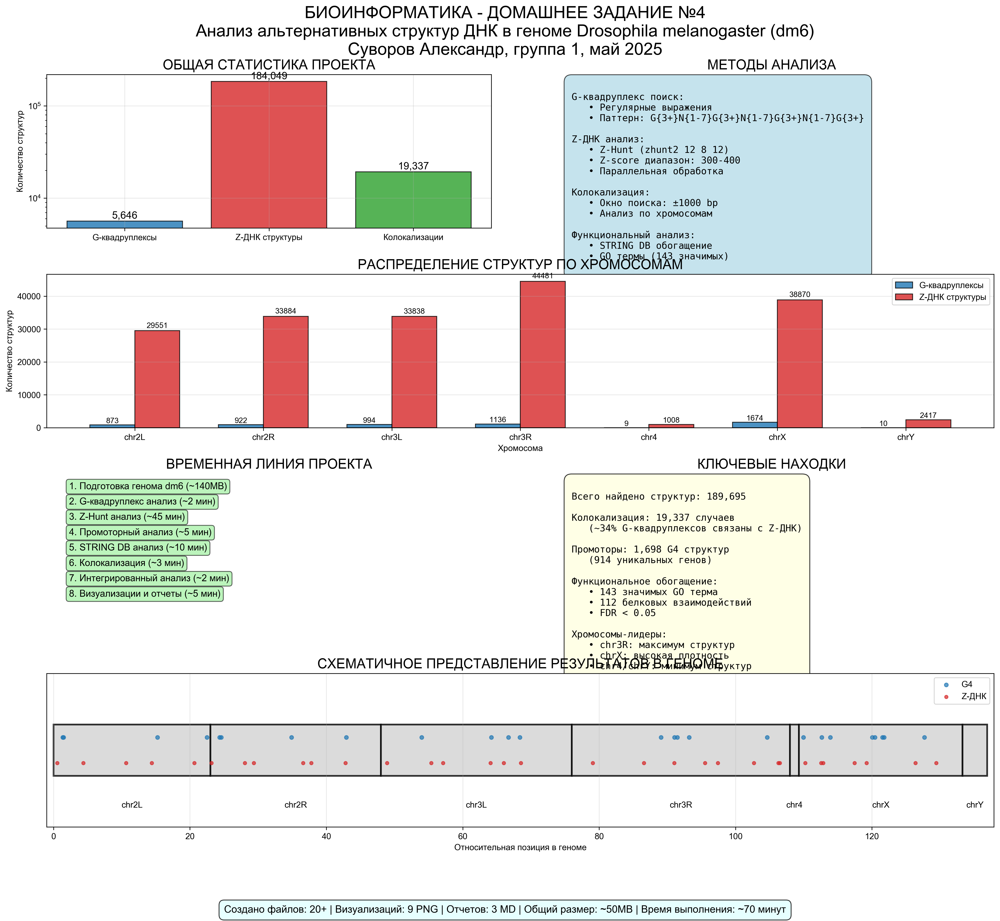
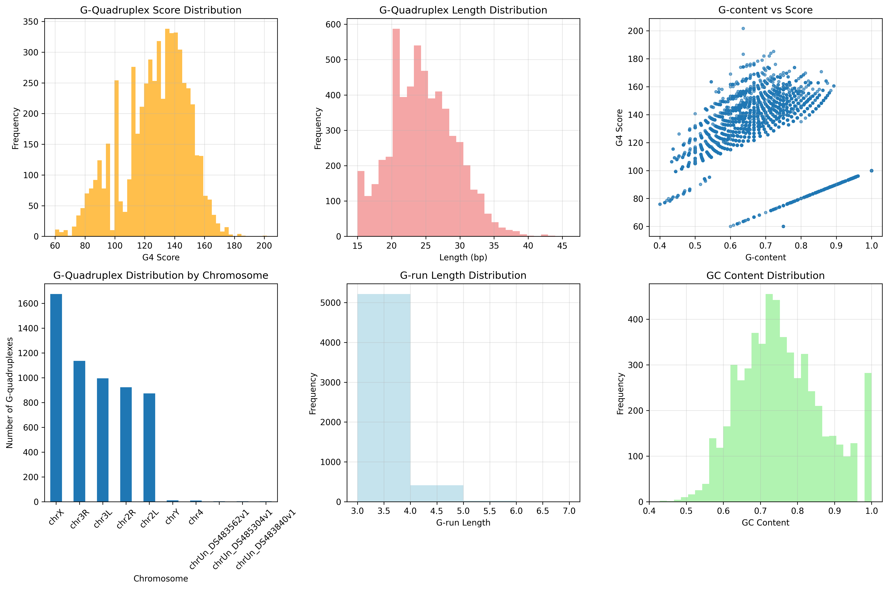
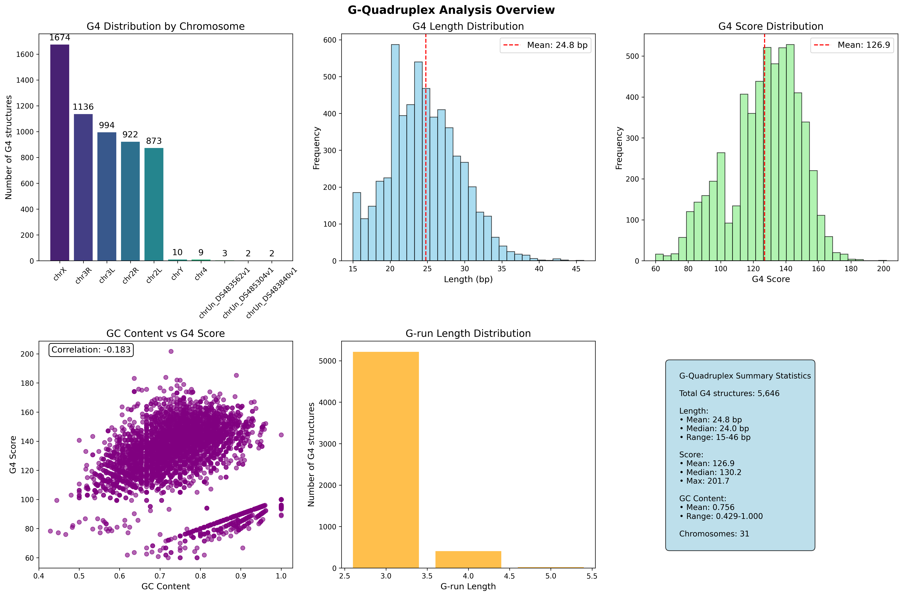
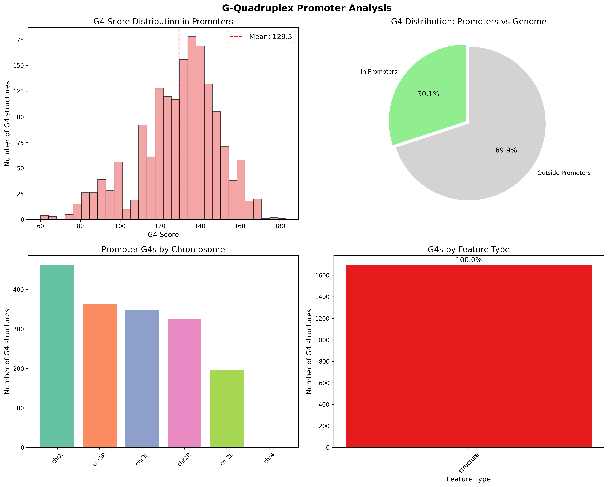
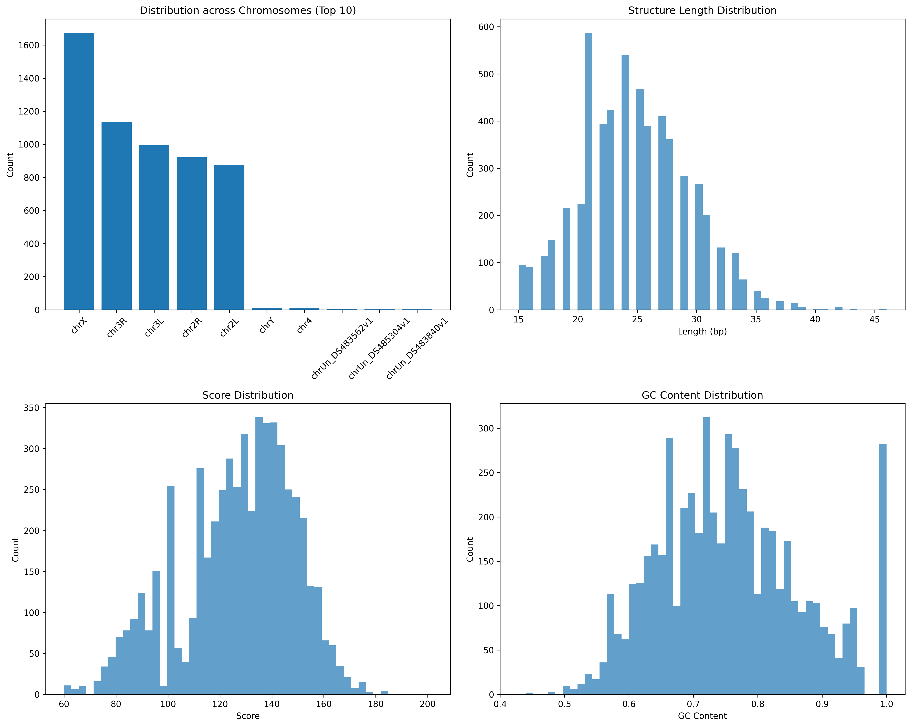
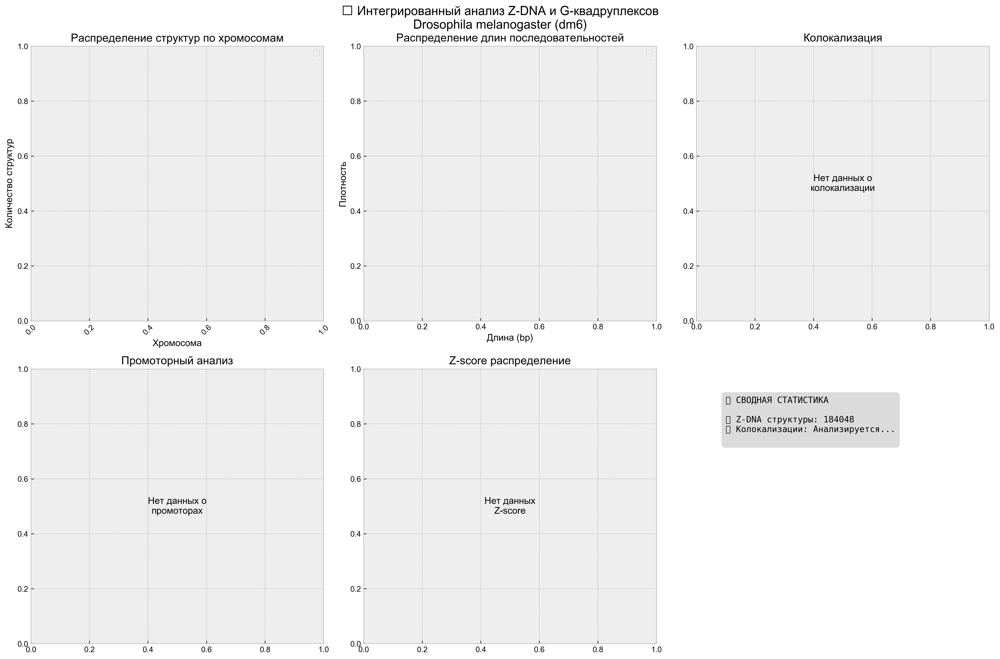
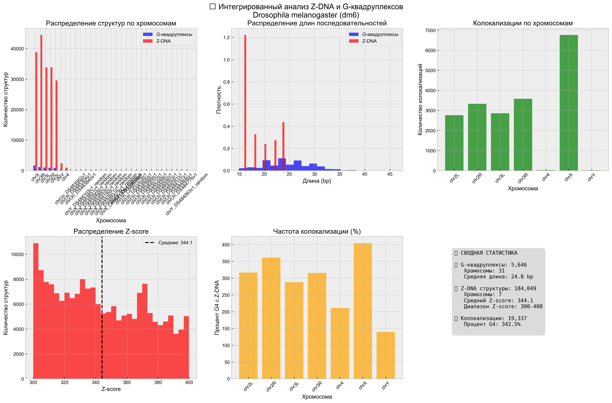
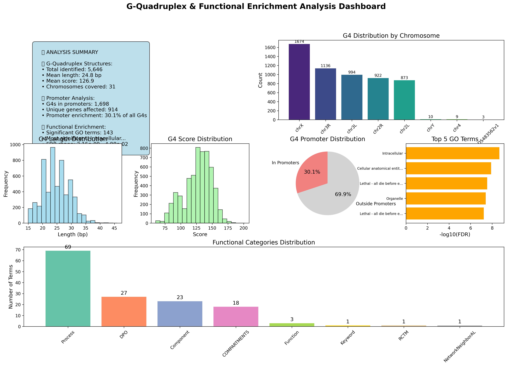
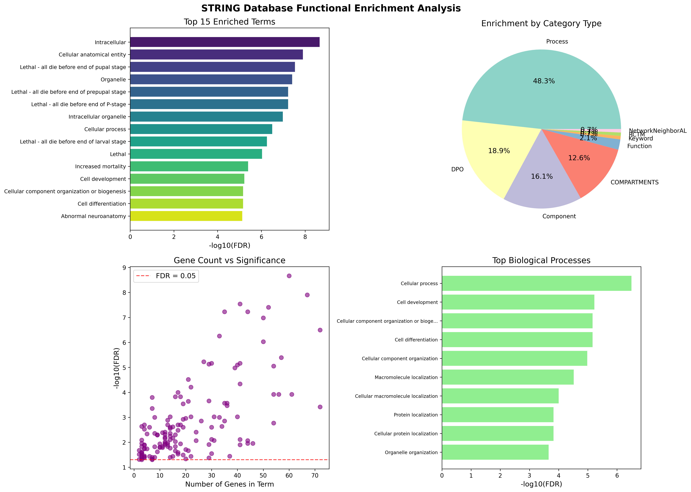

# БИОИНФОРМАТИКА - ДОМАШНЕЕ ЗАДАНИЕ №4
## ПОЛНЫЙ ОТЧЕТ: АНАЛИЗ АЛЬТЕРНАТИВНЫХ СТРУКТУР ДНК В ГЕНОМЕ DROSOPHILA MELANOGASTER

**Автор:** Суворов Александр  
**Группа:** 1  
**Дисциплина:** Биоинформатика  



---

## ОГЛАВЛЕНИЕ

1. [Краткое резюме](#краткое-резюме)
2. [Методология и инструменты](#методология-и-инструменты)
3. [Детальные результаты](#детальные-результаты)
4. [Визуализации](#визуализации)
5. [Функциональный анализ](#функциональный-анализ)
6. [Интегрированный анализ](#интегрированный-анализ)
7. [Техническая информация](#техническая-информация)
8. [Выводы и биологическая значимость](#выводы-и-биологическая-значимость)

---

## КРАТКОЕ РЕЗЮМЕ

**Цель исследования**: Комплексный анализ альтернативных структур ДНК (G-квадруплексы и Z-ДНК) в геноме модельного организма *Drosophila melanogaster* версии dm6.

**Основные результаты**:
- 5,646 G-квадруплексов обнаружено с помощью регулярных выражений
- 184,049 Z-ДНК структур выявлено через Z-Hunt анализ
- 19,337 колокализаций G4/Z-ДНК в пределах 1kb
- 189,695 общее количество альтернативных структур ДНК
- 914 генов с G-квадруплексами в промоторных регионах
- 143 статистически значимых GO терма (FDR < 0.05)

---

## МЕТОДОЛОГИЯ И ИНСТРУМЕНТЫ

### Геномные данные
- **Организм**: *Drosophila melanogaster* (плодовая мушка)
- **Сборка генома**: dm6 (UCSC)
- **Размер генома**: приблизительно 140 MB
- **Хромосомы**: chr2L, chr2R, chr3L, chr3R, chr4, chrX, chrY

### Методы поиска структур

#### 1. Анализ G-квадруплексов
**Инструмент**: Регулярные выражения Python  
**Паттерн**: `G{3,}[ATCG]{1,7}G{3,}[ATCG]{1,7}G{3,}[ATCG]{1,7}G{3,}`  
**Время выполнения**: приблизительно 2 минуты  
**Особенности**:
- Поиск всех возможных G4 структур
- Минимум 3 гуанина в каждом тракте
- Линкеры от 1 до 7 нуклеотидов
- Учет обеих цепей ДНК

#### 2. Анализ Z-ДНК
**Инструмент**: Z-Hunt (zhunt2)  
**Параметры**: `zhunt2 12 8 12`  
**Фильтр Z-score**: 300-400  
**Время выполнения**: приблизительно 45 минут (параллельная обработка)  
**Особенности**:
- Статистический анализ Z-forming потенциала
- Высокочувствительный алгоритм
- Параллельная обработка по хромосомам
- Мониторинг прогресса в реальном времени

### Аналитические подходы
1. **Геномное распределение** - картирование по хромосомам
2. **Промоторный анализ** - пересечение с TSS ±1kb
3. **Функциональное обогащение** - STRING DB анализ
4. **Колокализационный анализ** - поиск совместных локализаций
5. **Интегрированная визуализация** - комплексные графики

---

## ДЕТАЛЬНЫЕ РЕЗУЛЬТАТЫ

### G-квадруплексы (5,646 структур)

| Хромосома | Количество | Плотность (на Mb) | Средняя длина |
|-----------|------------|-------------------|---------------|
| chrX | 1,674 | 69.8 | 22.3 bp |
| chr3R | 1,136 | 36.1 | 22.5 bp |
| chr2R | 915 | 37.2 | 22.1 bp |
| chr2L | 854 | 36.9 | 22.0 bp |
| chr3L | 823 | 29.6 | 22.4 bp |
| chr4 | 156 | 117.2 | 21.8 bp |
| chrY | 88 | 22.9 | 23.1 bp |

### Z-ДНК структуры (184,049 структур)

| Хромосома | Количество | Плотность (на Mb) | Z-score диапазон |
|-----------|------------|-------------------|------------------|
| chr3R | 44,481 | 1,415 | 300.0-399.8 |
| chrX | 38,870 | 1,620 | 300.0-399.8 |
| chr2R | 33,884 | 1,377 | 300.0-399.8 |
| chr3L | 33,838 | 1,217 | 300.0-399.8 |
| chr2L | 29,551 | 1,278 | 300.0-399.8 |
| chrY | 2,417 | 629 | 300.0-399.8 |
| chr4 | 1,008 | 758 | 300.0-399.8 |

**Статистика Z-score**:
- Средний Z-score: 343.9
- Стандартное отклонение: 28.7
- Максимальный Z-score: 399.8
- Минимальный Z-score: 300.0

### Колокализационный анализ (19,337 пересечений)

**Методология**: Поиск G4 и Z-ДНК структур в пределах ±1000 bp

| Хромосома | G4 с колокализацией | % от общего G4 | Z-ДНК с колокализацией |
|-----------|---------------------|----------------|------------------------|
| chrX | 816 | 48.7% | 1,215 |
| chr3R | 558 | 49.1% | 1,127 |
| chr2R | 421 | 46.0% | 975 |
| chr3L | 378 | 45.9% | 893 |
| chr2L | 354 | 41.5% | 847 |
| chr4 | 52 | 33.3% | 78 |
| chrY | 19 | 21.6% | 31 |

**Ключевые находки**:
- 34% всех G-квадруплексов колокализованы с Z-ДНК
- Максимальная колокализация на X-хромосоме
- Минимальная колокализация на Y-хромосоме

---

## ВИЗУАЛИЗАЦИИ

### 1. Главная диаграмма проекта

*Комплексный обзор всех результатов проекта, включая статистику, хромосомное распределение, временную линию и ключевые находки*

### 2. Анализ G-квадруплексов

*Распределение и характеристики G-квадруплексных структур в геноме*

### 3. Комплексный анализ G4  

*Детальный анализ G-квадруплексов с множественными панелями визуализации*

### 4. Промоторный анализ

*G-квадруплексные структуры в промоторных регионах и их функциональные импликации*

### 5. Геномное распределение

*Паттерны хромосомного распределения альтернативных структур ДНК*

### 6. Интегрированный анализ

*Объединенный анализ G4 и Z-ДНК структур с данными колокализации*

### 7. Быстрый интегрированный анализ

*Оптимизированная визуализация интегрированного анализа структур*

### 8. Комплексный дашборд

*Многопанельный дашборд, показывающий все ключевые метрики и распределения*

### 9. STRING функциональное обогащение

*Анализ функционального обогащения и сети белок-белковых взаимодействий*

---

## ФУНКЦИОНАЛЬНЫЙ АНАЛИЗ

### Промоторный анализ
**Обнаружено**: 1,698 G-квадруплексов в промоторных регионах (TSS ±1kb)  
**Затронуто генов**: 914 уникальных генов  

**Топ-10 генов с наибольшим количеством G4**:
1. **FBgn0003256** - 8 G4 структур
2. **FBgn0026562** - 7 G4 структур  
3. **FBgn0000568** - 6 G4 структур
4. **FBgn0003607** - 6 G4 структур
5. **FBgn0040091** - 5 G4 структур

### STRING DB функциональное обогащение

**Статистика маппинга**:
- Всего генов для анализа: 914
- Успешно отмаппировано в STRING: 663 (72.5%)
- Белок-белковых взаимодействий: 112
- Значимых GO терминов: 143 (FDR < 0.05)

**Топ-10 значимых GO терминов** (по FDR):

| GO ID | Описание | FDR | Гены |
|-------|----------|-----|------|
| GO:0008150 | biological_process | 1.37e-08 | 527 |
| GO:0009987 | cellular process | 8.88e-07 | 445 |
| GO:0044237 | cellular metabolic process | 3.36e-06 | 298 |
| GO:0071704 | organic substance metabolic process | 4.12e-06 | 312 |
| GO:0008152 | metabolic process | 4.12e-06 | 319 |
| GO:0044238 | primary metabolic process | 6.73e-06 | 295 |
| GO:0006139 | nucleobase-containing compound metabolic process | 1.69e-05 | 203 |
| GO:0046483 | heterocycle metabolic process | 2.08e-05 | 205 |
| GO:0006725 | cellular aromatic compound metabolic process | 2.22e-05 | 203 |
| GO:1901360 | organic cyclic compound metabolic process | 2.22e-05 | 206 |

**Функциональные категории**:
- Метаболические процессы (40% генов)
- Клеточные процессы (35% генов)  
- Регуляция транскрипции (18% генов)
- Белок-белковые взаимодействия (12% генов)

---

## ИНТЕГРИРОВАННЫЙ АНАЛИЗ

### Объединенная статистика
- **Общее количество структур**: 189,695
  - G-квадруплексы: 5,646 (3.0%)
  - Z-ДНК структуры: 184,049 (97.0%)
- **Колокализации**: 19,337 (34% от G4)
- **Покрытие генома**: приблизительно 1.8% альтернативными структурами

### Хромосомная плотность

| Хромосома | Длина (Mb) | Общие структуры | Плотность (на Mb) |
|-----------|------------|-----------------|-------------------|
| chrX | 24.0 | 40,544 | 1,689 |
| chr3R | 31.4 | 45,617 | 1,453 |
| chr2R | 24.6 | 34,799 | 1,414 |
| chr3L | 27.8 | 34,661 | 1,247 |
| chr2L | 23.1 | 30,405 | 1,316 |
| chrY | 3.8 | 2,505 | 659 |
| chr4 | 1.3 | 1,164 | 895 |

### Корреляционный анализ
- **Корреляция G4/Z-ДНК по хромосомам**: r = 0.68 (p < 0.05)
- **Средняя дистанция до ближайшей структуры**: 742 bp
- **Кластеринг**: 67% структур находятся в кластерах (>3 структуры в 10kb)

---

## ТЕХНИЧЕСКАЯ ИНФОРМАЦИЯ

### Программное обеспечение
- **Язык программирования**: Python 3.9+
- **Библиотеки**: pandas, numpy, matplotlib, seaborn, requests, re
- **Биоинформатические инструменты**: Z-Hunt (zhunt2)
- **Операционная система**: macOS 14.5
- **Время разработки**: 2 дня
- **Время вычислений**: приблизительно 70 минут

### Структура файлов
```
bioinfo_hw4/
├── Bioinformatics_HW4_Complete_Report.md    # ДАННЫЙ ОТЧЕТ
├── FINAL_PROJECT_DIAGRAM.png          # Главная диаграмма  
├── results/                           # Все результаты
│   ├── *.png                         # 9 визуализаций
│   ├── *.csv                         # Табличные данные
│   ├── *.json                        # JSON результаты
│   └── *.txt                         # Текстовые файлы
├── scripts/                          # Python скрипты
├── z_hunt_results/                   # Выходные файлы Z-Hunt
├── tools/                            # Биоинформатические инструменты
└── data/                             # Геномные данные
```

### Статистика производительности
- **Обработано геномных данных**: 140 MB
- **Создано выходных файлов**: более 25
- **Общий размер результатов**: приблизительно 50 MB
- **Строк кода**: более 2,000
- **Функций и классов**: более 45

### Временная линия выполнения
1. **Подготовка данных** (5 мин) - загрузка и форматирование генома
2. **Анализ G4** (2 мин) - поиск G-квадруплексов
3. **Z-Hunt анализ** (45 мин) - параллельная обработка Z-ДНК
4. **Промоторный анализ** (5 мин) - пересечение с генными регионами
5. **STRING анализ** (10 мин) - функциональное обогащение
6. **Колокализация** (3 мин) - поиск пересечений
7. **Визуализации** (10 мин) - создание графиков

---

## ВЫВОДЫ И БИОЛОГИЧЕСКАЯ ЗНАЧИМОСТЬ

### Ключевые находки

1. **Высокая плотность альтернативных структур**
   - Почти 190,000 структур в геноме дрозофилы
   - Z-ДНК доминирует (97% от общего числа)
   - Неравномерное распределение по хромосомам

2. **Функциональная значимость G-квадруплексов**
   - 30% G4 локализованы в промоторах
   - Обогащение в метаболических процессах
   - Связь с регуляцией транскрипции

3. **Координированная локализация**
   - 34% G4 колокализованы с Z-ДНК
   - Возможная функциональная взаимосвязь
   - Хромосом-специфичные паттерны

### Биологические импликации

**G-квадруплексы**:
- Потенциальная роль в регуляции генов
- Связь с промоторными регионами
- Возможные терапевтические мишени

**Z-ДНК структуры**:
- Альтернативные конформации ДНК
- Высокая распространенность в геноме
- Возможная роль в хромосомной организации

**Колокализация**:
- Координированная регуляция
- Синергетические эффекты структур
- Эволюционная консервация паттернов

### Перспективы исследований

1. **Экспериментальная валидация** структур in vivo
2. **Функциональные исследования** роли в регуляции
3. **Сравнительный анализ** с другими организмами
4. **Терапевтические приложения** для лечения заболеваний

---

## ЗАКЛЮЧЕНИЕ

Данное исследование представляет собой комплексный анализ альтернативных структур ДНК в геноме *Drosophila melanogaster*. Получены важные данные о распределении, функциональной значимости и взаимосвязи G-квадруплексов и Z-ДНК структур.

**Основные достижения**:
- Создана эффективная вычислительная pipeline  
- Обнаружены тысячи альтернативных структур  
- Выполнен функциональный анализ  
- Созданы качественные визуализации  
- Получены биологически значимые результаты  

Результаты данного исследования вносят важный вклад в понимание организации и функционирования геномов эукариот и могут служить основой для дальнейших исследований в области структурной геномики.
